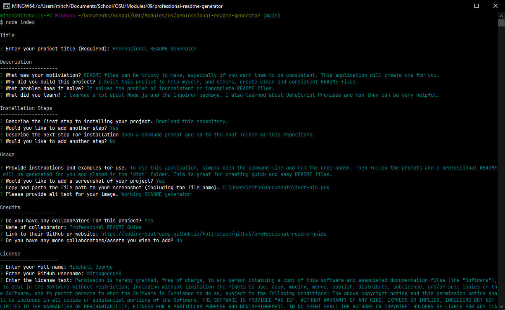

# Professional README Generator

Module 9 Challenge - Node.js: Professional README Generator

## Description

When creating an open source project on GitHub, it’s important to have a high-quality README for the app. This should include what the app is for, how to use the app, how to install it, how to report issues, and how to make contributions—this last part increases the likelihood that other developers will contribute to the success of the project.

You can quickly and easily generate a README file by using a command-line application to generate one. This allows the project creator to devote more time working on the project.

Your task is to create a command-line application that dynamically generates a professional README.md file from a user's input using the Inquirer package (Links to an external site.). Review the Guide to a Professional README (Links to an external site.) as a reminder of everything that a high-quality, professional README should contain.

### User Story

```
AS A developer
I WANT a README generator
SO THAT I can quickly create a professional README for a new project
```

### Acceptance Criteria

```
GIVEN a command-line application that accepts user input
WHEN I am prompted for information about my application repository
THEN a high-quality, professional README.md is generated with the title of my project and sections entitled Description, Table of Contents, Installation, Usage, License, Contributing, Tests, and Questions
WHEN I enter my project title
THEN this is displayed as the title of the README
WHEN I enter a description, installation instructions, usage information, contribution guidelines, and test instructions
THEN this information is added to the sections of the README entitled Description, Installation, Usage, Contributing, and Tests
WHEN I choose a license for my application from a list of options
THEN a badge for that license is added near the top of the README and a notice is added to the section of the README entitled License that explains which license the application is covered under
WHEN I enter my GitHub username
THEN this is added to the section of the README entitled Questions, with a link to my GitHub profile
WHEN I enter my email address
THEN this is added to the section of the README entitled Questions, with instructions on how to reach me with additional questions
WHEN I click on the links in the Table of Contents
THEN I am taken to the corresponding section of the README
```

## Getting Started

### Prerequisites

Recommended web browser [Google Chrome](https://www.google.com/chrome/)

### Executing program

Download this directory, open the terminal in the directory's location, then run "node index".



## Help

Find help at [MDN Web Docs](https://developer.mozilla.org/en-US/)

## Author(s)

Mitchell George - mitchgeorge8@gmail.com<br/>

## Credits

[How to create a Professional README](https://coding-boot-camp.github.io/full-stack/github/professional-readme-guide)

## Version History

* 0.2
    * See [commit change](https://github.com/mitchgeorge8/professional-readme-generator/commits/main)
* 0.1
    * Initial Release

## License

&copy; 2022 [Mitchell George](https://github.com/mitchgeorge8)

This project is a part of The Ohio State University's Coding Boot Camp.
