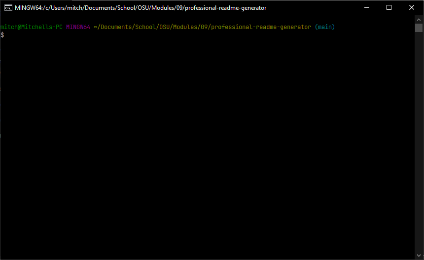

# Professional README Generator

## Description

README files can be tricky to make, especially if you want them to be consistent. This application will create one for you.

I built this project to help myself, and others, create clean and consistent README files.

It solves the problem of inconsistent or incomplete README files.

I learned a lot about Node.js and the Inquirer package. I also learned about JavaScript Promises and how they can be very helpful.

## Table of Contents

- [Installation](#installation)
- [Usage](#usage)
- [Credits](#credits)
- [License](#license)

## Installation

1. Download this repository.
2. Open a command prompt and cd to the root folder of this repository.

## Usage

To use this application, simply open the command line and run the code above. Then follow the prompts and a professional README will be generated for you and placed in the 'dist' folder. This is great for creating quick and easy README files.

## Credits

1. [Professional README Guide](https://coding-boot-camp.github.io/full-stack/github/professional-readme-guide)

## License

&copy; 2022 [Mitchell George](https://github.com/mitchgeorge8)

Permission is hereby granted, free of charge, to any person obtaining a copy of this software and associated documentation files (the "Software"), to deal in the Software without restriction, including without limitation the rights to use, copy, modify, merge, publish, distribute, sublicense, and/or sell copies of the Software, and to permit persons to whom the Software is furnished to do so, subject to the following conditions: The above copyright notice and this permission notice shall be included in all copies or substantial portions of the Software. THE SOFTWARE IS PROVIDED "AS IS", WITHOUT WARRANTY OF ANY KIND, EXPRESS OR IMPLIED, INCLUDING BUT NOT LIMITED TO THE WARRANTIES OF MERCHANTABILITY, FITNESS FOR A PARTICULAR PURPOSE AND NONINFRINGEMENT. IN NO EVENT SHALL THE AUTHORS OR COPYRIGHT HOLDERS BE LIABLE FOR ANY CLAIM, DAMAGES OR OTHER LIABILITY, WHETHER IN AN ACTION OF CONTRACT, TORT OR OTHERWISE, ARISING FROM, OUT OF OR IN CONNECTION WITH THE SOFTWARE OR THE USE OR OTHER DEALINGS IN THE SOFTWARE.
